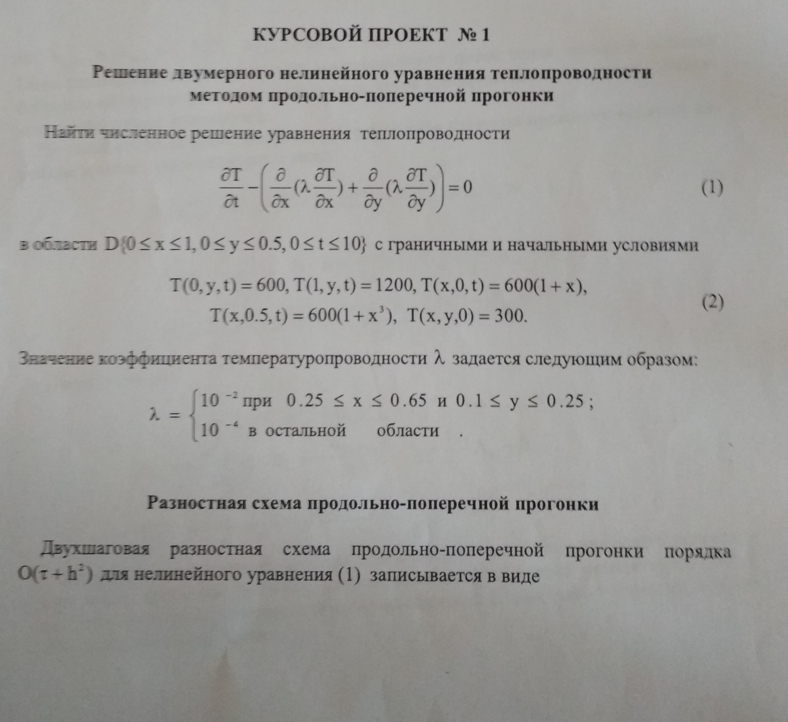
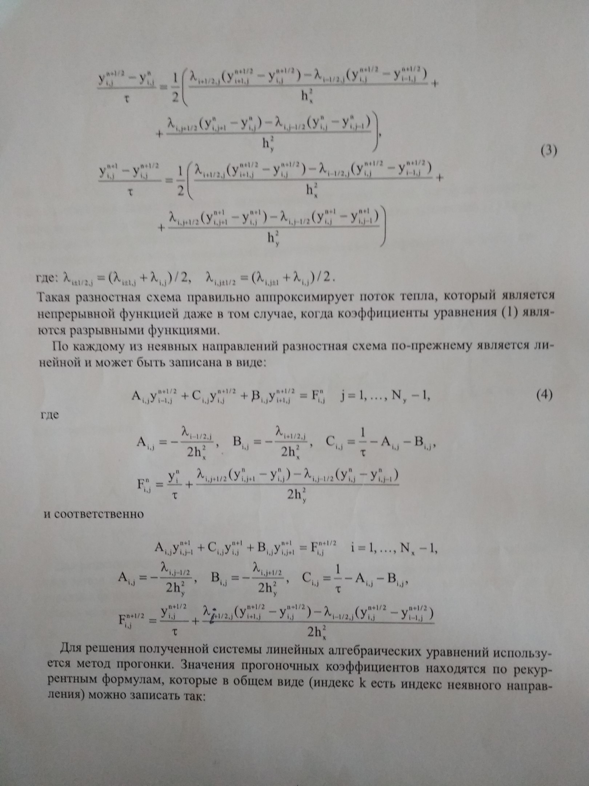
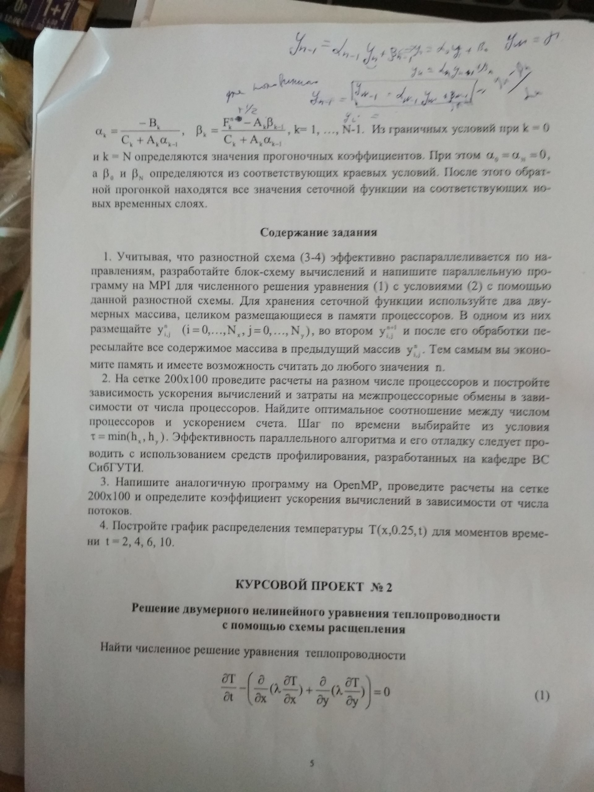

# FDM-ADI-2D-Heat-Equation
An algorithm to solve 2D Heat Equation numerically using ADI method

It doesn't work properly, but the idea is correct. Possible errors in a,b,c,f coeffs computing.

# Task description

